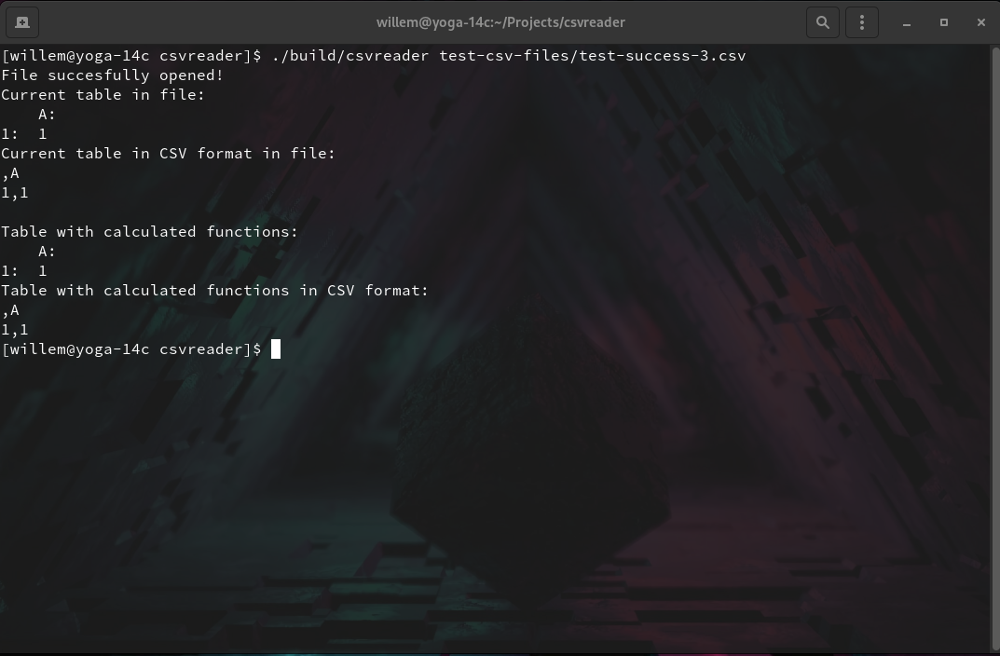
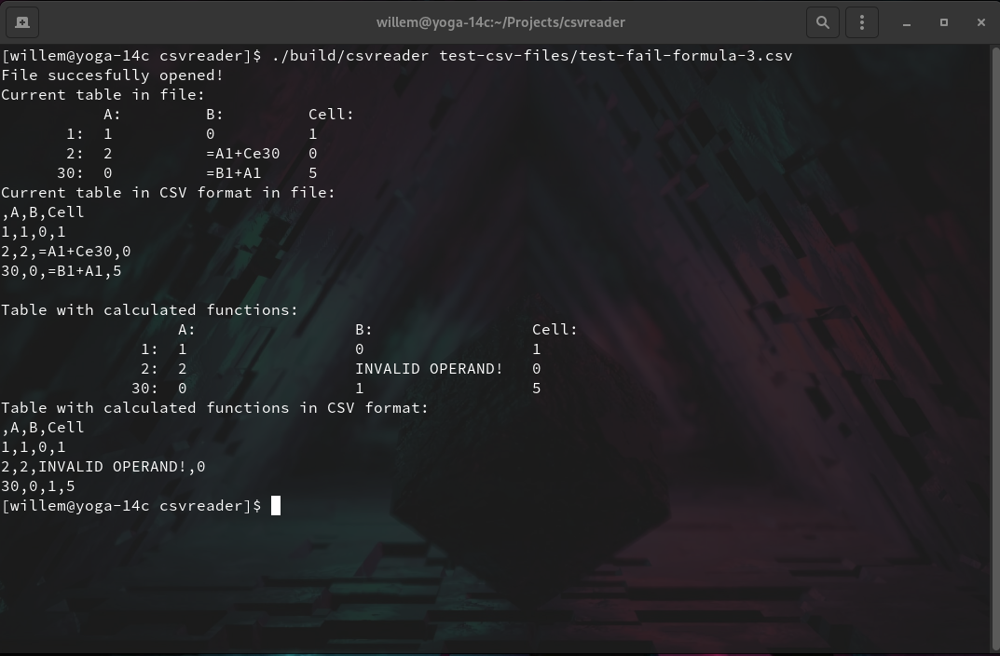
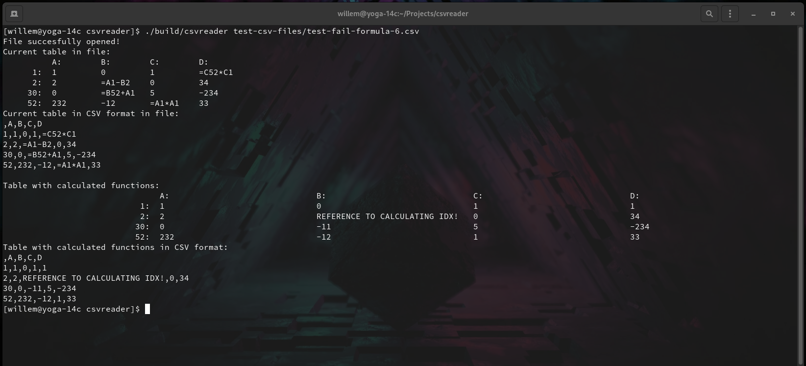

# About
Программа была написана согласно ТЗ для тестового задания. Читает csv таблицу из *.csv файла и, при необходимости, находит значения функций, указанных в ячейках как:  
```= ARG1 OP ARG2```  
где ```ARG1``` и ```ARG2``` - адреса ячеек в таблице,   
а ```OP``` - одна из операций: ```{+, -, *, /}```  
  
Причем значения в ячейках - целые числа (расширено - хранить можно что угодно, но, если вычисляется значение функции, то ее операнды должны быть целыми числами).  
P.S. В моем случае ```/``` - целочисленное деление (ведь, раз храним целочисленные, то и тут тоже).
# Building
Для сборки программы нужно произвести 4 команды в терминале из каталога проекта ($ - приглашение системы к вводу): 
```
$ g++ -c tablemodel.cpp
$ g++ -c tableview.cpp
$ g++ -c main.cpp
$ g++ -o csvreader main.o tablemodel.o tableview.o
```
Или же можно дать права на выполнение файла сборки и запустить через терминал из каталога проекта:
```
$ chmod +x build-csvreader.sh
$ ./build-csvreader.sh
```
# Running
Для запуска программы введите в командной строке Linux (как понял, можно написать для любой платформы. В случае чего, команды сборки должны работать и для Windows. Проверю, если понадобится):
```
$ ./csvreader file.csv
```
Редактируйте файл как пожелаете. Сообщения об ошибках были как можно более проработаны.
# Testing
Далее будет серия тестов для демонстрации возможностей работы программы. 

**- Примеры запуска программы:**  
  

**- Пример 1 успешной работы программы:**  


**- Пример 2 успешной работы программы:**  
  

**- Пример 3 успешной работы программы:**  
  

**- Пример 4 успешной работы программы(csv файл):**  
  

**- Пример 4 успешной работы программы(вывод программы):**  


**- Пример 1 ошибки структуры файла(csv файл):**  


**- Пример 1 ошибки структуры файла(вывод):**  


**- Пример 2 ошибки структуры файла(csv файл):**  


**- Пример 2 ошибки структуры файла(вывод):**  


**- Пример 3 ошибки структуры файла(csv файл):**  


**- Пример 3 ошибки структуры файла(вывод):**  


**- Пример 4 ошибки структуры файла(csv файл):**  


**- Пример 4 ошибки структуры файла(вывод):**  


**- Пример 1 ошибки формулы в таблице:**  


**- Пример 2 ошибки формулы в таблице:**  


**- Пример 3 ошибки формулы в таблице:**  


**- Пример 4 ошибки формулы в таблице:**  


**- Пример 5 ошибки формулы в таблице:**  


**- Пример 6 ошибки формулы в таблице:**  


**- Пример 7 ошибки формулы в таблице (перекрестные ссылки на индексы в формулах, пока не решено, ввиду ограниченности времени. Тем не менее, программа завершается аварийно также):**  

